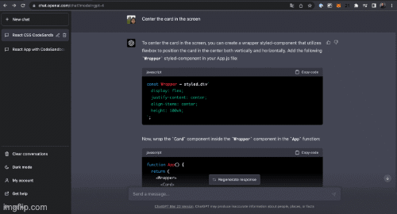

# CodeSandbox_React_ChatGPT 👋

Based on designcode course [Design and Code with ChatGPT and Midjourney](https://designcode.io/gpt4-apps)

  
  
     Card in React with ChatGPT4
      
    <a href="#">
    
    
  
   
     
    <a href="https://github.com/brenfondeadora/CodeSandbox_React_ChatGPT/issues/new">Report bug</a>
    ·
    <a href="https://github.com/brenfondeadora/CodeSandbox_React_ChatGPT/issues/new">Request feature</a>

 

## 🤖 Requirements

- Have an account plus on [chatgpt](https://chat.openai.com/) to use chatgpt4
- Have an account on [codesamplebox](https://codesandbox.io/) to use codesample

## 👤 Author

**Brenda Saavedra**

- WebPage: [brendasaavedra.com](http://brendasaavedra.com)
- Github: [@brenfondeadora](https://github.com/brenfondeadora/)

 

## 📝 License

Copyright © 2022 [Brenda Saavedra](https://github.com/brenfondeadora). 
This project is [MIT License](LICENSE)
